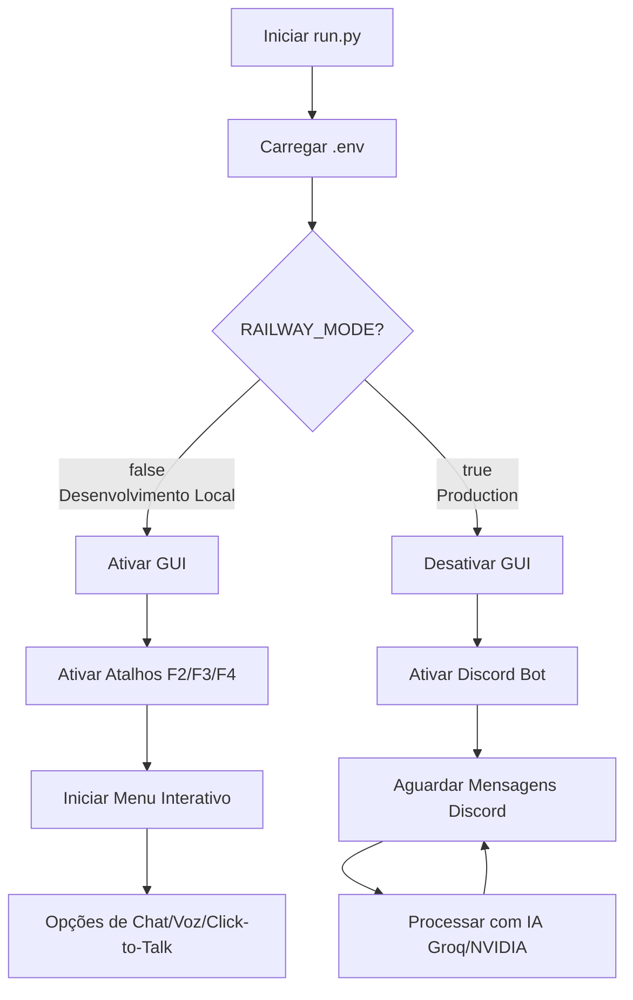

# 🏗️ Arquitetura: Local vs Railway

## Fluxo Executável



## Componentes por Modo

### 🏠 Modo Local (RAILWAY_MODE=false)

```
run.py
├── LocalVoiceFilter         ✅ Ativo
├── GUI Tkinter              ✅ Ativo (comentado, pronto para expandir)
├── Atalhos Teclado (F2-F4)  ✅ Ativo
├── AppLauncher              ✅ Ativo
├── VTuber Overlay           ✅ Ativo (condicional)
├── Discord Bot              ⚠️ Background (comentado)
└── Menu Interativo          ✅ Ativo
```

### 🚀 Modo Railway (RAILWAY_MODE=true)

```
run.py
├── LocalVoiceFilter         ❌ Não usado
├── GUI Tkinter              ❌ Desativada
├── Atalhos Teclado          ❌ Desativados
├── AppLauncher              ❌ Desativado
├── VTuber Overlay           ❌ Desativado
├── Discord Bot              ✅ Processo Principal
└── Menu Interativo          ❌ Desativado
```

## Fluxo de Processamento de Mensagens

### Em Qualquer Modo

```
Mensagem Recebida
    ↓
[on_message evento Discord]
    ↓
Remove menção do bot (se houver)
    ↓
Chama processar_ia()
    ↓
├─ Groq LLM para lógica
├─ NVIDIA API (Kimi) se necessário
├─ Pesquisa DDG se solicitado
├─ LocalVoiceFilter (local) ou skip (Railway)
└─ Responde no Discord
```

## Persistência de Dados

```
Arcana/armazen/
├── brain.json           (Configurações da Emma)
├── memoria.json         (Memória de conversas)
└── pesquisa_memoria.json (Histórico de buscas)

💾 Estes arquivos funcionam tanto em Local como Railway!
```

## Variáveis de Ambiente Críticas

```env
# Sempre necessárias
GROQ_API_KEY_LLM=required
DISCORD_BOT_TOKEN=required (para usar Discord)

# Recomendadas
GROQ_API_KEY_VISION=recommended
NVIDIA_API_KEY=optional (para modo Kimi)

# Configuração de Ambiente
RAILWAY_MODE=true/false (automático na maioria dos casos)
```

## Fluxo de Inicialização Comparado

### 🏠 Local
```
1. Carrega .env
2. Inicializa IA clients
3. Inicia GUI thread
4. Registra atalhos de teclado
5. Inicia Discord Bot em background
6. Mostra menu interativo
7. Aguarda input do usuário
```

### 🚀 Railway
```
1. Carrega .env
2. RAILWAY_MODE=true detectado
3. Inicializa IA clients
4. Skip: GUI (não há display)
5. Skip: Atalhos (não há teclado)
6. Skip: Menu interativo
7. Inicia Discord Bot como processo principal
8. Aguarda mensagens Discord indefinidamente
```

## Recursos Utilizados

### Local
```
CPU:     Variável (depende do uso)
RAM:     ~200-500MB
Storage: 100MB+ (cache torch, modelos)
```

### Railway (Free Tier)
```
CPU:     Compartilhado
RAM:     512MB limite
Storage: 5GB limite
Uptime:  500h/mês
```

## IA e Personalidade - Completamente Preservada

A Emma mantém:

✅ Sistema de raciocínio Groq
✅ Acesso a NVIDIA API (Kimi)
✅ Vozes TTS (edge-tts)
✅ Pesquisa na web (DDG)
✅ Sistema de memória persistente
✅ Personalidade e contexto
✅ Todas as capacidades inteligentes

❌ **Apenas** removemos:
- Interface gráfica (sem valor em servidor)
- Entrada de áudio (sem microfone)
- Atalhos do sistema (sem acesso)
- Automação de Apps (não há apps)

## Redeploy/Atualizações

```bash
# Fazer mudança no código
git add .
git commit -m "Fix: ..."
git push origin main

# Railway automaticamente detecta o push e redeploy!
```

---

**Resultado**: Emma funciona identicamente em ambos os ambientes,
apenas com interface diferente (CLI local, Discord Bot no servidor) 🎭
